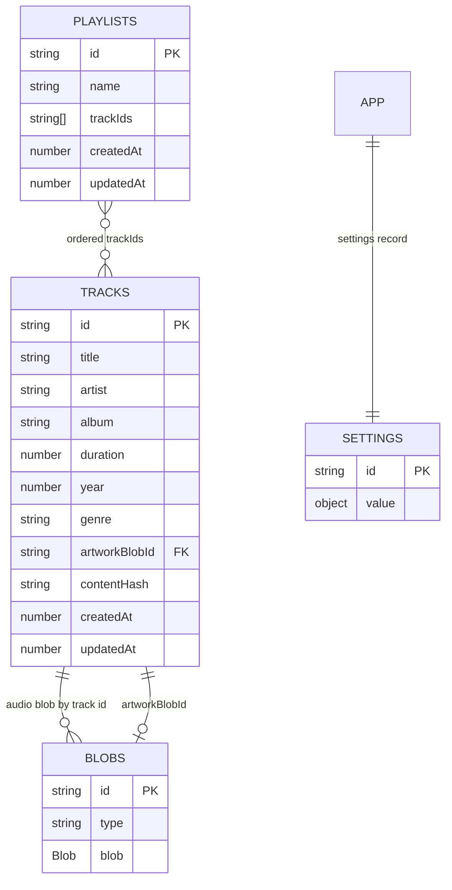

# Folio Local Music

A private, Spotify-style player for MP3s you already own. Folio has no account, API, analytics, or external music service: track metadata, artwork, playlists, settings, and audio blobs live in the browser's IndexedDB.

## Features

- Import multiple MP3s by drag-and-drop or file picker; read ID3 title, artist, album, year, genre, duration, and embedded cover art.
- SHA-256 deduplication, with filename and duration as a fallback; tags fall back to the file name when parsing fails.
- Search, sort, multi-select, and queue actions in the library.
- Create, rename, and delete playlists; add/remove tracks and drag rows to reorder.
- Persistent queue with play-next, remove, reorder, clear, shuffle, repeat, and session-position restoration.
- Native audio playback, Media Session controls, responsive player bar, and a dedicated now-playing view.
- Dark and light themes; keyboard-accessible controls, visible focus rings, and reduced-motion support.
- Installable PWA shell and offline browsing/playback for audio already stored in IndexedDB.
- JSON export/restore for track metadata, playlists, and settings.

## Screenshots

Add current UI captures in `docs/screenshots/` when available:

| Library | Now playing | Playlists |
| --- | --- | --- |
| `[library.png placeholder]` | `[now-playing.png placeholder]` | `[playlists.png placeholder]` |

## Stack

- React 18, TypeScript (strict), Vite, React Router
- Tailwind CSS build configuration with a small CSS-variable design system
- Dexie / IndexedDB, `music-metadata-browser`, browser File, Audio, Media Session, and Service Worker APIs
- Native drag-and-drop for queue and playlist ordering

## Data model



The audio blob uses the track ID as its blob ID. Cover images use their own IDs referenced by `artworkBlobId`. The queue is an ordered list of track IDs plus a current index in the settings record. Dexie schema changes should increment the database version and add an explicit migration in `src/db/indexedDb.ts`.

## Local development

Prerequisites: Node.js 20 or newer and npm.

```bash
npm install
npm run dev
```

Open the local URL printed by Vite. In development, **Add demo tracks** on the import screen seeds a few tiny generated WAV tones for quick UI/player checks; the action is not present in production.

```bash
npm run lint
npm run build
npm run preview
```

The production build emits static files to `dist/`. No server, database credentials, environment variables, or backend are required.

## Deploy to Vercel

1. Push this project to a Git repository and import it in Vercel.
2. Keep the detected Vite defaults, or set the build command to `npm run build` and output directory to `dist`.
3. Deploy. `vercel.json` rewrites client-side routes to `index.html`.
4. Use the deployed HTTPS URL once while online so the service worker can install its shell cache. Vercel's generated HTTPS deployment is suitable for PWA installation.

## Install and test offline

1. Open the HTTPS deployment in a supported browser. Use the browser's Install app command (Chrome/Edge) or Add to Home Screen (Safari on iOS).
2. Import one or more MP3s while online. Wait until the import summary confirms they were saved.
3. Visit the library and playlists once so the app shell is cached.
4. In browser developer tools, select **Network → Offline**, then reload `/songs`. Previously imported tracks can still be played because audio is read from IndexedDB, not the service worker cache.
5. A first visit with no cached shell cannot run the app offline; the static offline page explains that it needs one online visit first.

The service worker caches the app shell and same-origin build assets, and uses a bounded cache-first strategy for fetched image requests. Embedded artwork and audio are stored in IndexedDB directly. The service worker does not attempt to duplicate either blob store.

## Backup and restore

On the Playlists page, choose **Export JSON** to download track metadata, playlist membership/order, and app settings. **Restore JSON** merges the records by ID. Audio and cover blobs are intentionally excluded to keep the backup portable and small; after restoring on another browser/device, import the original MP3 files again. Matching content hashes prevent creating a duplicate track for an unchanged file, but metadata-only imports cannot recreate missing audio.

## Acceptance walkthrough

1. Go to **Import music**, choose a tagged MP3, and wait for the import summary.
2. Open **All songs**; confirm title, artist, duration, and embedded cover art appear. Importing the same MP3 again should count as a duplicate.
3. Select the track's queue action; open the bottom queue control and confirm it appears. Start playback, then collapse and reopen the queue.
4. Create a playlist, open it, choose **Add songs**, and add the imported track.
5. Add a second track and drag rows to reorder them. Reload the page and verify the new order persists.
6. With the app shell loaded and tracks imported, take the browser offline, reload `/songs`, and play an imported track.

## Troubleshooting and limitations

- **Storage quota:** Browser quotas depend on the browser, device, and free disk space. Large libraries can fail with a quota message. Remove unused tracks in browser site data or use a device with more available storage. Folio cannot guarantee durable storage if the browser evicts site data.
- **Keep data local:** Clearing site data, using private browsing, or switching browser profiles may remove the library. Export metadata regularly; keep original audio files separately.
- **Restore behavior:** JSON backups do not contain audio/artwork blobs. Re-import original MP3s after restoring to regain playable tracks and embedded covers.
- **Browser support:** Playback formats and Media Session actions vary. The app imports MP3 files only; playback is handled by the browser's native audio element.
- **iOS/Safari:** Install prompts are browser-controlled; use Share → Add to Home Screen. Background playback, lock-screen artwork, storage eviction, and offline behavior may differ by iOS version. Keep the installed app open once online after an update.
- **Offline first run:** Service workers require HTTPS (localhost is allowed in development) and an initial online visit. Browser audio stored in IndexedDB remains the source for offline playback.
- **Tag parsing:** Malformed or unsupported tags fall back to the filename and unknown artist/album. SHA-256 uses Web Crypto; environments without it use the filename/duration fallback only if hashing fails (the import may otherwise show an error).
- **Demo tracks:** Development seeding creates short generated WAV samples for interface checks; normal import accepts MP3 files.