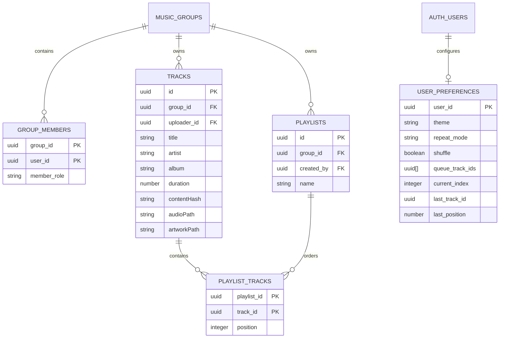

# Folio Group Music

A private group library for MP3s your friends upload and play together. Folio does not search or provide a public music catalog. User accounts and metadata use Supabase Auth and Postgres; audio and artwork use a private Supabase Storage bucket. Vercel serves the Vite frontend.

## Features

- Email/password signup, sign-in, password reset, and protected group library.
- Create one group and issue one-time, seven-day invite codes for friends.
- Upload MP3s with ID3 metadata and embedded cover art to the group's private storage.
- SHA-256 deduplication, with filename and duration as a fallback.
- Shared group track list; playlist edits are limited to the playlist owner and group admins.
- Persistent per-account queue, playback position, theme, shuffle, and repeat settings.
- Native audio playback, Media Session controls, responsive player bar, and a dedicated now-playing view.
- Dark and light themes; keyboard-accessible controls, visible focus rings, and reduced-motion support.
- Existing local MP3s can be uploaded from IndexedDB; local originals are retained.

## Screenshots

Add current UI captures in `docs/screenshots/` when available:

| Library | Now playing | Playlists |
| --- | --- | --- |
| `[library.png placeholder]` | `[now-playing.png placeholder]` | `[playlists.png placeholder]` |

## Stack

- React 18, TypeScript (strict), Vite, React Router
- Tailwind CSS build configuration with a small CSS-variable design system
- Supabase Auth, Postgres Row Level Security, and private Storage
- Dexie / IndexedDB for importing existing local libraries; `music-metadata-browser`, browser File, Audio, Media Session, and Service Worker APIs
- Native drag-and-drop for queue and playlist ordering

## Data model



Every exposed table has explicit grants and row-level policies. Private storage paths are scoped to `group_id/user_id/track_id`; reads require group membership, uploads use the signed-in uploader's path, and only the uploader or an admin can delete a file. Invite codes are high-entropy random values; only their SHA-256 hashes are stored.

## Local development

Prerequisites: Node.js 20 or newer and npm.

```bash
npm install
npm run dev
```

Copy `.env.example` to `.env.local` and fill in the Supabase project URL and publishable key. These are public client settings; do not put a Supabase secret/service-role key in a `VITE_` variable.

Open the local URL printed by Vite. Without these settings, the app shows a setup message and authentication is unavailable.

```bash
npm run lint
npm run build
npm run preview
```

The production build emits static files to `dist/`. The deployed app requires its Supabase project to be configured separately.

## Supabase Setup

1. Create a Supabase project on the Free plan.
2. Open the SQL Editor and run `supabase/migrations/20261001000000_shared_music_library.sql`.
3. Keep email/password signups and email confirmation enabled. Set the Auth Site URL to the Vercel app URL and add both `http://localhost:5173/**` and `http://127.0.0.1:5173/**` to the allowed redirect URLs for local development. Signup and password-reset emails return to the app's current origin.
4. Configure a custom SMTP provider before inviting friends. Supabase's default sender is best-effort, limited to 2 emails per hour, and only delivers to addresses on the Supabase organization team. A free SMTP tier may be available from third parties, but requirements and limits vary; verify the provider's current terms and sender/domain requirements. Do not add friends as Supabase organization members to bypass this restriction; that grants project dashboard access. Do not disable confirmation just to work around email delivery without accepting that unverified addresses can be registered.
5. Copy the Supabase project URL and publishable key into `.env.local` for local development. Add the same variables to Vercel for Production and Preview deployments.
6. Deploy the Vite project to Vercel with build command `npm run build` and output directory `dist`. The existing rewrite handles React routes.
7. Create an account, confirm the email, create the group, then use the invite button to generate a code for each friend. A code expires after 7 days and can be redeemed once.

The migration creates a private bucket with a 50 MiB per-file limit and allows MP3, JPEG, PNG, and WebP content types. Current Supabase Free limits list 1 GB file storage, 5 GB egress, 500 MB database size, and free projects may pause after a week of inactivity. Vercel Hobby is $0 for personal, non-commercial use. These limits can change; check [Supabase pricing](https://supabase.com/pricing) and [Vercel pricing](https://vercel.com/pricing) before launch. No plan offers unlimited free music hosting.

Never add a service-role/secret key to the frontend. The browser uses only the publishable key; Postgres grants, RLS, and Storage policies enforce access. Do not make the bucket public.

## Local Library Migration

The first visit after setup does not automatically upload tracks from IndexedDB. On **Import music**, use **Upload local MP3s** to send existing local MP3s to the group. Local originals remain in IndexedDB, and non-MP3 local records are skipped. Keep separate copies of important audio files; this app does not currently provide a cloud backup/export workflow.

## Tests and Security Checks

Run `npm run lint` and `npm run build`. With the Supabase CLI and local Docker database configured, run the SQL policy test with `supabase test db`.

Before inviting friends, verify that a second account can read and play group tracks but cannot access another group's records, alter another user's account settings, or delete another uploader's files. Test signup confirmation and password recovery with real non-team email addresses. Offline browsing may load the cached app shell, but cloud audio playback requires a network connection.

Only upload music and artwork that you have the right to store and share with your group. The project does not provide music licensing or a public streaming catalog.

- **SMTP:** Supabase's default sender cannot deliver to arbitrary friend addresses. Configure custom SMTP; its free-tier status and requirements depend on the email provider.
- **Quotas:** When free storage or egress limits are exhausted, uploads or playback may stop until usage resets or data is removed. The app does not promise unlimited storage.
- **Offline:** Only the app shell is cached. Audio playback and cloud library operations need an internet connection.
- **Local data:** Browser-local MP3s are not visible to other group members until uploaded. Migration retains local copies.
- **Deletion:** Track rows and storage are private; account/group deletion and orphaned-file cleanup are not automated in this initial version.
- **Email ownership:** Keep email confirmation enabled for real friend accounts. Do not share account passwords; each person should create their own account.